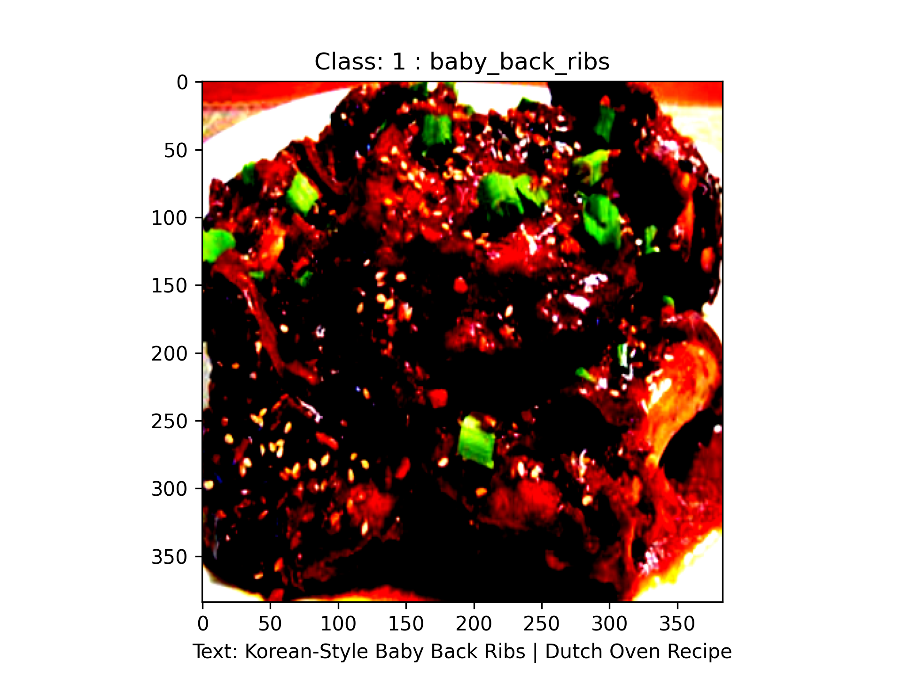

# UPMC-Food101-ImageText-Fusion
- [UPMC-Food101-Dataset](https://hal.science/hal-01196959/file/CEA_ICME2015.pdf): is a large multimedia dataset with
101 food categories, it consists of food images associated with their textual descriptions. Here is a link to download the dataset from: [UPMC-Food101 dataset](https://www.kaggle.com/datasets/gianmarco96/upmcfood101)
- Visual modality is implemented in: [UMPC-Image.ipynb](UMPC-Image.ipynb)
- Textual modality is implemented in: [UMPC_Text.ipynb](UMPC_Text.ipynb)
- Multimodal Fusion is implemented in: [UMPC_Fusion_ImgTxt.ipynb](UMPC_Fusion_ImgTxt.ipynb)
- Also Custom dataset for multimodal dataset is implemented in Pytorch in: [UMPC_Dataset.py](UMPC_Dataset.py)
- Also some preprocessing were implemented on original CSV files and new processed CSV files are saved in: [UMPC_Dataset_Analysis.ipynb](UMPC_Dataset_Analysis.ipynb)

## Dataset Sample (Image+Text Caption)

## Results
<table>
<tr>
<th>Model  </th>
<th> Accuracy </th>
</tr>
<tr>

<td> Image: ViT </td>
<td> 72.83% </td></tr> 
<td> Text: BERT </td>
<td> 85.28% </td></tr> 
<td> <strong> Late Fusion </td>
<td> <strong> 93.83% </td></tr> 
  
</table>

